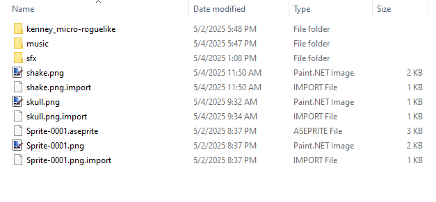

# Robot Citadel Rush
[Robot Citadel Rush](https://mronosa.itch.io/robot-citadel-rush) was built in Godot for the [SoloDevelopment 72-hour Jam #7](https://itch.io/jam/solodevelopment-jam-7).

Free assets were used during development.

* Art by Kenney - https://kenney.nl/assets/micro-roguelike  
* Sound Effects by TomMusic - https://tommusic.itch.io/free-fantasy-200-sfx-pack
* Music by alkakrab - https://alkakrab.itch.io/free-12-tracks-pixel-rpg-game-music-pack 
  * Ghost Castle
  * Dark Woods
  * Magickal River
* The "Shaker" Godot plugin was used for camera shake - https://github.com/Eneskp3441/Shaker

Assets are not included in this repo. It was set up like so:
